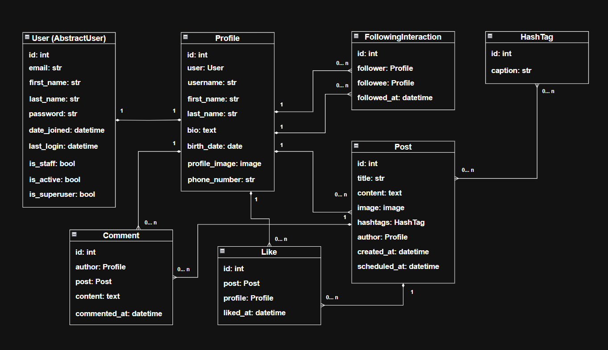

# Social Media API

## Introduction

This project is a RESTful API built with Django and Django REST Framework
for a social media platform. It allows users to create posts, like posts,
follow other users, and manage their profiles.

## Features

- **User Registration and Authentication with JWT**: Users register their
  accounts and create profiles. They obtain a JWT token for authentication.
  On logout the refresh token is blacklisted.
- **User Profile Management**: Users can create and manage their profiles with
  adding bio, birth date, phone number, and profile image. They can search other
  users by username, first name, and last name.
- **Authorization with permissions**: Only authenticated users allowed to
  perform actions like creating posts, liking posts, manage and delete their
  own profiles, and following/unfollowing others.
- **Follow/Unfollow**: Users can follow and unfollow other users. They can get
  a list of their followers and followees.
- **Like/Unlike**: Users can like and unlike posts. They can get a list of
  liked posts as well as the list of their own posts. Users can add comments to
  posts.
- **Post Management**: Users can create and manage their own posts with images,
  retreive a list of all posts. They can filter posts by hashtags and author's
  username.
- **Image Upload**: Users can upload images for their posts.
- **Swagger Documentation**: Endpoints are documented with requests and
  responses examples.
- **Scheduled Post Creation**: With Celery and Redis, users can schedule posts
  to be created at a specific time.
- **Clean Blacklisted Tokens as a periodic task**: With Celery Beat,
  users can set periodic tasks to clean blacklisted tokens.

## Installing with GitHub

There is .env.sample file to see how to set environment variables.

```bash
git clone https://github.com/dkibalenko/social-media-api
cd social-media-api
python3 -m venv env
source venv/Scripts/activate
pip install -r requirements.txt
set SECRET_KEY
set CELERY_BROKER_URL
set CELERY_RESULT_BACKEND
python manage.py migrate
python manage.py runserver
# Run Celery to enable scheduled posts
celery -A social_media_api worker -l info
# Run Celery Beat for periodic tasks
celery -A social_media_api beat -l INFO --scheduler django_celery_beat.schedulers:DatabaseScheduler
```

## Installing with Docker

- Copy .env.sample to .env and populate it with your environment variables
```bash
docker compose build
docker compose up
```
- Bash into your Django container
```bash
docker exec -it <your_django_container_name> bash
```
- Run the createsuperuser Command and populate the database:
```bash
python manage.py createsuperuser
python manage.py loaddata sample_data.json
```

## Getting access

- Get access token via `/api/user/token/`
- Enter Test User credentials

## Test User

- Email: admin@admin.com
- Password: admin

## Contributing

- Fork the repository
- Create a new branch (`git checkout -b <new_branch_name>`)
- Commit your changes (`git commit -am 'message'`)
- Push the branch to GitHub (`git push origin <new_branch_name>`)
- Create a new Pull Request

## **Database Schema**

